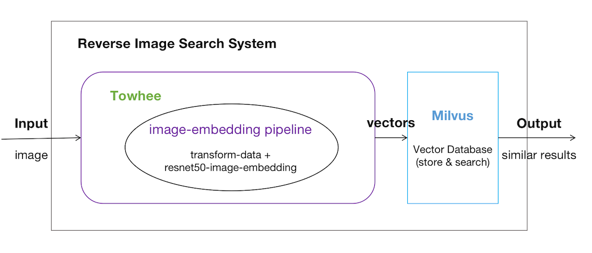

### Overview

**Reverse image search** helps you search for similar or related images given an input image. Reverse image search is a [content-based image retrieval](https://en.wikipedia.org/wiki/Content-based_image_retrieval) (CBIR) query technique that involves providing the CBIR system with a query image that it will then base its search upon. Unlike the traditional image search (which often relies on performing text queries across user-generated labels), reverse image search is based on the content of the image itself.

The applications of reverse image search include finding the original source of an image, searching for similar content, and product recommendation:

**Find the source**: Search for the exact same image, often to find the original source of the image, or a low-resolution thumbnail.

**Get the similar image**: Find similar images based on the photos taken, helping designers and staff find similar works faster and more efficiently.

**Product recommendation**: Search for product images taken by users on the e-commerce platform to find the same or similar products, and recommend related products, improving the convenience of searching, and optimizing user experience.

These reverse image search applications are the most common in various fields, but how to analyze images efficiently and accurately still has questions. Are the searched image results satisfactory? Is search efficient when it has a large amount of data? Or is there a unified plan for these applications? What technology is needed to achieve it?

### Key components

With the quick development of AI technology, there are more and more methods to processing unstructured data, and the reverse image search application above can be realized with AI models. Before processing with the models, the image data needs to be pre-processed or transformed. And in the scenarios of reverser image search, model is usually used to extract image feature vectors, and after getting the feature vectors, we can store it and query with vector database.

##### Preprocessing

It's very important to do image data pre-processing and transform, including cropping, normalization, data enhancement, data convention(convert image data into a uniform data format, such as PIL.Image,tensor) etc. It will archive better image analysis after image transformation.

##### Embedding model

Models are used to extract embedding vectors; models are often the most critical component of modern CBIR systems. When trained on a large dataset such as [ImageNet](https://www.image-net.org/) or [YFCC100M](http://projects.dfki.uni-kl.de/yfcc100m/), intermediate representations generated by deep learning models often correspond to features based on layer depth - lower-level features such as edges and corners are represented better by earlier layers, while higher-level semantics within the image are better represented by layers deeper within the model.

The image embedding pipeline in the figure is based on the Resnet50 model. Acquiring embedding vectors from Resnet50 is incredibly easy in Towhee:

```python
>>> from towhee import pipeline
>>> embedding_pipeline = pipeline('image-embedding')  # instantiate the pipeline
```

##### Vector database

In order to achieve a wonderful reverse image search system, effective search tools are very important. When dealing with very large vectors, using exact search methods will make the system very slow. So we need a vector database that can build an index for faster search, and also safely store the data.

[Milvus](http://milvus.io) is an open source vector database that can achieve millisecond-level responses over hundreds of millions of vectors. It contains a variety of options for indices and similarity metrics, which can meet the various computing needs of users.

```python
>>> from milvus import Milvus
>>> milvus = Milvus(host='localhost', port='19530')
>>> results = milvus.search(collection_name='reverse_image_search', query_records=query_embeddings, top_k=10, params={'nprobe': 16})
```

Note that this step assumes that Milvus (and its Python bindings) is already installed and that vectors have already been added into the database. For more information on the installation and insert process, please visit the [Milvus docs](https://milvus.io/docs/v1.1.1/install_milvus.md).

### Putting it all together

As mentioned in the previous section, a reverse image search system consists of three main components:

1. Image preprocessing (normalization),
2. A forward pass through a machine learning model, and
3. A vector database for vector storage, indexing, and querying.

The following code snippet will allows you to implement a reverse image search system using Towhee:

```python
>>> from towhee import pipeline
>>> from milvus import Milvus
>>> embedding_pipeline = pipeline('image-embedding')
>>> query_embeddings = embedding_pipeline('/path/to/img')
>>> results = milvus.search(collection_name='reverse_image_search', query_records=query_embeddings, top_k=10, params={'nprobe': 16})
```



### Resources

In the reverse image search system, image feature extraction can be achieved through a Towhee pipeline such as [`image-embedding-resnet50`](https://hub.towhee.io/towhee/image-embedding-resnet50). Please visit [this page](pipelines/image-embedding) a full list of image embedding pipelines Towhee supports.
